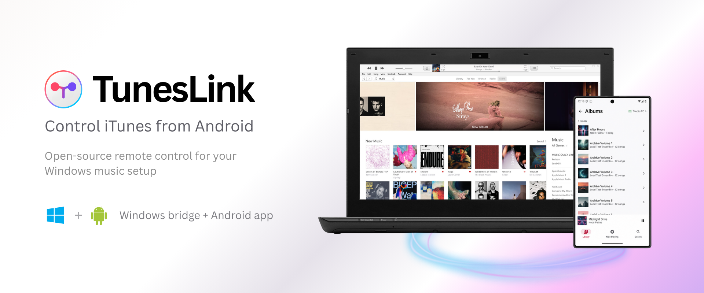
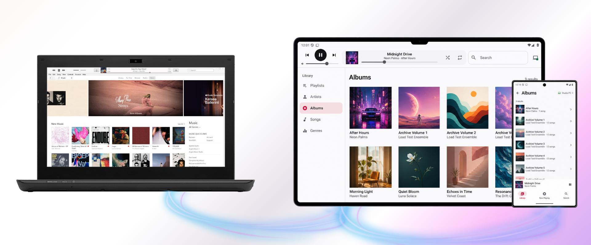

<p align="center">
  
</p>

# TunesLink

TunesLink lets you browse and control **iTunes Legacy on a Windows PC** from an Android phone or
tablet. It is a small, private remote for people who still keep their own music library in iTunes.

Use it to find an album from the sofa, change the song across the room, or control a Windows music
setup from a touch-friendly tablet interface. TunesLink does not stream or upload the music itself;
it controls the iTunes library already playing on your computer

> [!IMPORTANT]
> TunesLink works with the legacy iTunes COM interface on Windows. **Apple Music for Windows is not
> supported.**

## Why I built it

Years ago, I used an iPod touch app to control iTunes without having to sit at my computer. I still
keep my full music library in iTunes, but when I later wanted the same simple experience from
Android, I could not find a remote that fit.

TunesLink started as the tool I wanted for my own setup: local, focused, touch-friendly, and free of
accounts or cloud services. I made it open source for anyone else who still values their personal
iTunes library and wants to control it from a modern Android device.

## What you get

TunesLink has two parts that work together:

| Runs on | App | What it does |
|---|---|---|
| Windows PC | `TunesLink.Bridge.exe` | Talks to iTunes and securely shares controls with your local network |
| Android phone or tablet | `TunesLink.apk` | Provides the library, search, and playback interface |

<p align="center">
  
</p>

From Android you can:

- browse playlists, artists, albums, songs, and genres;
- search the iTunes library;
- view album artwork and the current track;
- play, pause, skip, seek, and change the volume;
- turn shuffle on or off;
- use repeat off, repeat all, or repeat one;
- use layouts designed separately for phones, landscape screens, and tablets.

The Windows bridge can run in the notification area, start automatically when you sign in, and
retain up to two paired phones or tablets.

## Privacy by design

TunesLink is a direct connection between devices you own. There is no TunesLink account, cloud
relay, analytics service, advertising SDK, or hosted music service. Library metadata, artwork, and
playback commands stay on your trusted local network.

Connections are paired with a temporary six-digit code and then protected by certificate-pinned
HTTPS and a per-device token. TunesLink accepts private/local IPv4 clients only. Do not
port-forward its ports or expose the bridge to the internet.

## Requirements

### To use TunesLink

- Android 8.0 (API 26) or newer;
- Windows 11 x64, or a Windows 10 x64 release supported by .NET 10;
- iTunes Legacy for Windows with COM automation;
- both devices on the same trusted private Wi-Fi or Ethernet network.

Windows 7, Windows 8, and Windows 8.1 are not supported. The Windows bridge is self-contained, so
people using a release build do **not** need to install .NET separately.

## Install and connect

### 1. Download both apps

[Download the latest release from GitHub Releases](https://github.com/kamyarps/tuneslink/releases).
You need both `TunesLink.Bridge.exe` and `TunesLink.apk`.

The repository's **Code → Download ZIP** option downloads the source code, not ready-to-run apps.
If a public release is not available yet, follow [Build from source](#build-from-source).

> [!NOTE]
> The Windows executable is not Authenticode-signed yet, so Windows may show an **Unknown
> publisher** warning. Compare its SHA-256 value with the release's `SHA256SUMS.txt` before running
> it. The release APK is signed separately.

### 2. Start the Windows bridge

1. Open iTunes Legacy.
2. Run `TunesLink.Bridge.exe`. It is portable and does not require an installer or administrator
   access.
3. If Windows Firewall asks for permission, allow it on **Private networks only**.

The bridge must stay running while you use the Android remote. Closing the window keeps it in the
Windows notification area by default. Choose **Exit** from its tray icon to stop it completely.

### 3. Install and pair Android

1. Copy `TunesLink.apk` to the Android device and open it. Android may ask you to allow installs
   from the browser or file manager you used.
2. Open TunesLink and choose **Find my computer**.
3. If discovery does not find the bridge, choose **Enter address** and enter the private address
   shown by the Windows app.
4. Enter the six-digit pairing code shown on the PC. The code expires after 10 minutes.

You normally pair only once. Pair again if the Android app is reset, the bridge identity changes,
or that device is removed from **Paired phones** in the Windows bridge.

## How it works

```text
┌──────────────────┐       private LAN       ┌────────────────────┐
│ Android app      │  pinned HTTPS + SSE     │ Windows bridge     │
│ Compose UI       │ ◀────────────────────▶ │ local API/security │
└──────────────────┘                         └─────────┬──────────┘
                                                      │ isolated worker protocol
                                            ┌─────────▼──────────┐
                                            │ iTunes worker      │
                                            │ Windows COM        │
                                            └─────────┬──────────┘
                                                      │
                                            ┌─────────▼──────────┐
                                            │ iTunes Legacy      │
                                            └────────────────────┘
```

The Android app discovers the bridge over UDP or connects to its private IPv4 address manually.
After pairing, it sends authenticated commands over pinned HTTPS. Current playback updates arrive
through an authenticated Server-Sent Events channel, with compatible polling available for mixed
app versions.

The Windows app exposes only the local API and security boundary. iTunes automation runs in a
separate worker process, so the bridge can recover if iTunes becomes unresponsive. The worker also
maintains a bounded library snapshot; Android keeps bounded metadata and artwork caches so pages
reopen quickly without keeping the entire library in memory.

Discovery uses UDP port `45831`; authenticated control uses TCP/HTTPS port `45832`. The two apps
are released together and currently use wire protocol `TunesLink-3`.

## Bridge behavior and local data

- **Close to tray:** enabled by default. Disable **Keep TunesLink running when the window closes**
  if the close button should exit instead.
- **Open at login:** starts the bridge in the background for the current Windows user.
- **Paired devices:** up to two devices can be retained; each can be revoked from the bridge.
- **Collection playback:** when Android starts an album, artist, or genre, the bridge creates one
  temporary `TunesLink Playback Queue` playlist so iTunes keeps Next, Previous, shuffle, repeat,
  and automatic track changes inside that collection. The managed playlist can appear in iTunes
  while it is active and is removed when playback switches elsewhere.
- **Windows data:** identity, paired-device hashes, settings, and the bounded metadata index live
  under `%LOCALAPPDATA%\TunesLink Bridge`.
- **Android data:** credentials use encrypted platform storage; metadata and artwork caches are
  bounded and scoped to the paired bridge.

## Troubleshooting

### The phone cannot find the computer

Confirm both devices are on the same private network. Allow UDP `45831` and TCP `45832` through
Windows Firewall on **Private networks only**. Do not create a Public-network rule and do not
port-forward either port.

If discovery still fails, choose **Enter address** on Android and use the private IPv4 address shown
in the Windows bridge.

### The bridge shows a VPN or virtual-adapter address

TunesLink prefers gateway-backed Wi-Fi or Ethernet. Disconnect an unnecessary VPN, check the
adapter named in the address tooltip, and choose **New code** or reopen the bridge to refresh the
selection.

### Android says the bridge identity changed

Pair again only if you intentionally reset, moved, or reinstalled the bridge. If the change is
unexpected, stop and inspect the PC before trusting the new identity.

### Android cannot access the local network

Open Android Settings for TunesLink and allow **Local network**. Android 17/API 37 enforces this
permission; earlier Android releases ignore it.

### The bridge reports an unexplained failure

Choose **Open diagnostics folder** from the bridge's tray menu, or inspect
`%LOCALAPPDATA%\TunesLink Bridge\diagnostics.log`. The bounded diagnostic log excludes credentials,
addresses, music metadata, and exception messages.

## Build from source

TunesLink's build is designed for Windows and produces both applications in one run.

### Easiest build

```powershell
git clone https://github.com/kamyarps/tuneslink.git
cd tuneslink
.\BUILD.bat
```

You can also double-click `BUILD.bat`. It checks the exact toolchain, runs verification, builds both
apps, and opens `artifacts/` when it finishes.

A successful build produces exactly:

```text
artifacts/
├── TunesLink.apk
└── TunesLink.Bridge.exe
```

### Check the toolchain only

Use the preflight when setting up a development machine:

```powershell
.\scripts\one-click-build.ps1 -PreflightOnly
```

It verifies the exact .NET SDK feature band, JDK major, Android platform, `android.jar`, `aapt2`,
`d8`, `apksigner`, and Gradle configuration without creating packages.

`-SkipChecks` exists for faster local packaging after checks have already passed. It should not be
used to prepare a release.

### What verification covers

The full workflow runs Android lint and unit tests, debug and release package builds, the Windows
release build, formatting verification, bridge self-tests, responsive WinUI layout checks, build
requirements self-tests, and repository hygiene checks.

CI adds Android emulator coverage on API 26, 31, and 36, rotation and delayed-pagination cases,
worker-hang recovery, artifact-size budgets, and a full-history secret scan.

To run the optional integration test against a real iTunes library and current track:

```powershell
& '.\artifacts\TunesLink.Bridge.exe' --live-itunes-test
```

The test restores the original playback settings when it finishes.

## Contributing, support, and security

Bug reports and focused contributions are welcome.

## License

TunesLink is available under the [MIT License](LICENSE).

iTunes is a trademark of Apple Inc. TunesLink is independent and is not affiliated with or
endorsed by Apple.
